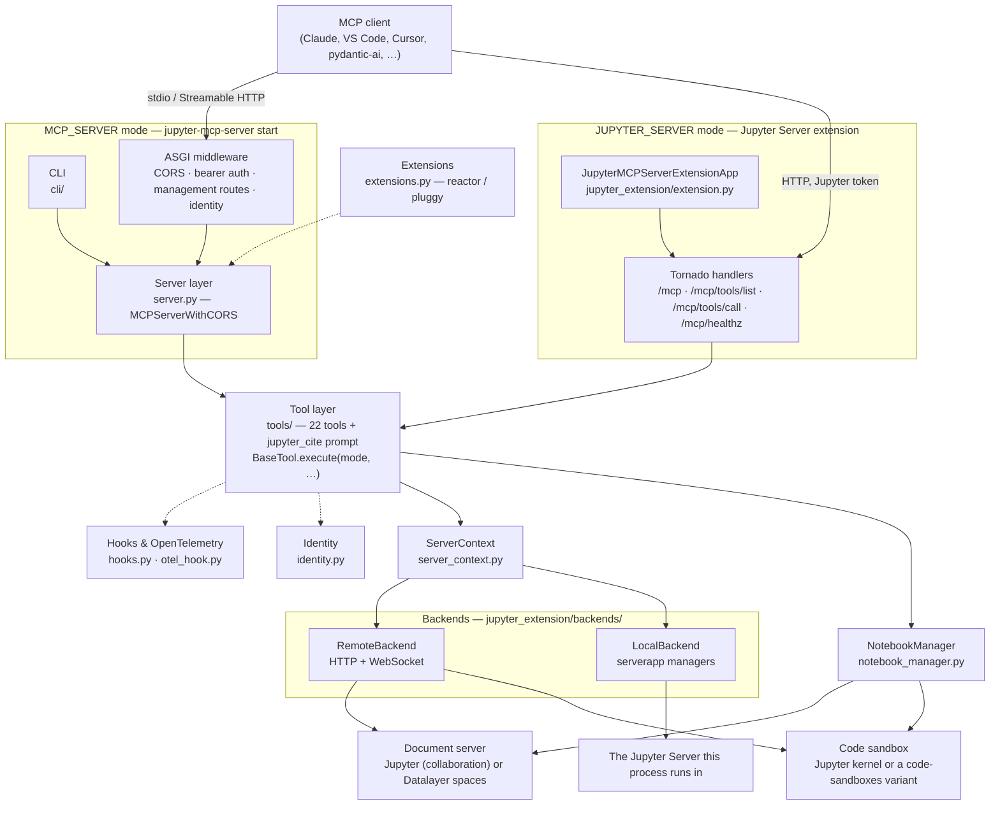

# Architecture

Jupyter MCP Server is one codebase that runs in **two modes**, with the same
tools in both:

- **MCP_SERVER mode** — a standalone process started with `jupyter-mcp-server start`.
  It speaks MCP to the client over `stdio` or Streamable HTTP, and reaches the
  notebooks and the execution environment over HTTP and WebSocket.
- **JUPYTER_SERVER mode** — a Jupyter Server extension. The same tools run
  inside the Jupyter process, talk to its managers directly, and are served
  under the server's `/mcp` endpoint.

Two things are deliberately kept apart, because a deployment can host them on
different servers:

- the **document** side — where the notebook files live (`--document-url`, a
  Jupyter server or [Datalayer](https://datalayer.ai) spaces, selected by
  `--document-provider`), edited through the collaborative document so that
  what the agent changes is what a person editing the same notebook sees;
- the **execution** side — the **code sandbox** that runs the cells
  (`--code-sandbox-url`). By default that is a Jupyter kernel; with
  `--sandbox-variant` it can be any engine from the
  [`code-sandboxes`](../code-sandboxes/index.mdx) package.

## High-level view



Whichever way a call comes in, it ends in the same place: a tool's
`execute()` method, told which `ServerMode` it is running in and handed the
clients or managers that mode provides.

## Components

### CLI (`cli/`)

A [Typer](https://typer.tiangolo.com) application with three commands,
installed as `jupyter-mcp-server` and runnable as `python -m jupyter_mcp_server`:

- `start` — run the server. Its options fall into families: the transport
  (`--transport stdio|streamable-http`, `--port`), the document side
  (`--document-url`, `--document-id`, `--document-token`, `--document-provider`),
  the execution side (`--code-sandbox-url`, `--sandbox-variant`,
  `--start-new-code-sandbox`, `--code-sandbox-id`, …), MCP authentication
  (`--mcp-token`, `--insecure-mcp-noauth`), execution limits
  (`--execution-timeout`, `--max-execution-timeout`) and observability
  (`--otel-file`). `--jupyter-url` and `--jupyter-token` set both sides at once.
- `connect` — point a running Streamable HTTP server at a document and code
  sandbox, through its `PUT /api/connect` route.
- `stop` — release the server's code sandbox, through `DELETE /api/stop`.

The CLI fills the `JupyterMCPConfig` singleton, starts (or attaches to) the
code sandbox, auto-enrolls the configured notebook, registers the
OpenTelemetry hook when asked to, and then runs the transport.

### Server layer (`server.py`)

The MCP protocol implementation, on the
[MCP Python SDK](https://github.com/modelcontextprotocol/python-sdk) (mcp 2).

- `MCPServerWithCORS` subclasses the SDK's `MCPServer`. Its
  `streamable_http_app()` builds the ASGI application **stateless** and wraps it
  in, innermost first: `IdentityMiddleware` (publishes the verified caller to
  the tools), `ManagementRouteSecurityMiddleware` (Host/Origin checks and bearer
  authentication on the management routes), Starlette's
  `AuthenticationMiddleware` with the SDK's `BearerAuthBackend` when a token
  verifier is configured, and CORS.
- Its `call_tool()` keeps the reason when a tool fails. mcp 2 would otherwise
  reduce any exception to `Error executing tool <name>`; the tools raise plain
  errors carrying exactly what the agent needs to recover — which notebook is
  not connected, which index is out of range — so the message is put back.
- Every tool is registered with `@mcp.tool(...)` (with `ToolAnnotations`) and
  wrapped in `@with_hooks`, and delegates to a tool class through
  `safe_notebook_operation()`, which retries on a dropped WebSocket.
- Custom routes: `PUT /api/connect`, `DELETE /api/stop`, `GET /api/healthz`.
- The `jupyter_cite` prompt, and `get_registered_tools()`, which the Jupyter
  extension uses to expose the tool list without hardcoding it.

Transports are described in [MCP Transports](../mcp-transports/index.mdx).

### Tools (`tools/`)

Each tool is a class deriving from `BaseTool` with one method,
`execute(mode, sandbox_server_client, contents_manager, kernel_manager,
notebook_manager, ...)`. The `ServerMode` argument (`MCP_SERVER` or
`JUPYTER_SERVER`) selects the execution path; the other arguments are whatever
that mode can provide.

| Category | Tools |
| --- | --- |
| Server | `list_files`, `list_kernels`, `connect_to_jupyter` |
| Notebook management | `use_notebook`, `list_notebooks`, `restart_notebook`, `unuse_notebook`, `read_notebook` |
| Cells | `insert_cell`, `insert_execute_code_cell`, `overwrite_cell_source`, `edit_cell_source`, `execute_cell`, `read_cell`, `delete_cell`, `clear_cell_output`, `move_cell`, `execute_code` |
| Prompt | `jupyter_cite` |

Extensions add tools of their own (see [Extensions](#extensions)); the
bundled sandboxes extension contributes `launch_sandbox`, `list_sandboxes`,
`use_sandbox` and `terminate_sandbox`.

### Configuration (`config.py`)

`JupyterMCPConfig`, a Pydantic model held as a singleton (`get_config()` /
`set_config()`), is the one place the CLI options, the extension traits and
`PUT /api/connect` all write to. It carries the transport, the document side
(`document_provider`, `document_url`, `document_id`, `document_token`), the
execution side (`code_sandbox_url`, `sandbox_variant`, `code_sandbox_id`,
tokens, GPU and environment hints), the execution timeouts, and the JupyterLab
tools allowlist.

Its `resolved_document_token` and `resolved_code_sandbox_token` prefer the
**caller's** credential when a request carries one (see
[Identity](#identity-and-authentication)), and fall back to the configured
token — the single-user case.

Every option is listed in [Configuration](../operations/configuration/index.mdx).

### Server context (`server_context.py`, `jupyter_extension/context.py`)

`ServerContext` is a singleton that works out the mode at startup and holds
what the tools need in that mode:

- in **JUPYTER_SERVER** mode, the `ServerApp` managers — `contents_manager`,
  `kernel_manager`, `kernel_spec_manager`, `session_manager` — registered by
  the extension through `jupyter_extension/context.py`;
- in **MCP_SERVER** mode, two `JupyterServerClient` instances,
  `sandbox_server_client` and `document_server_client`, since the two halves
  may be different servers, together with the authentication headers for each.
  Password-protected Jupyter servers are handled by logging in for a session
  cookie (`auth.py`) and logging in again when a request is refused.

### Notebooks and code sandboxes (`notebook_manager.py`, `sandbox_client.py`)

`NotebookManager` tracks the notebooks the agent has opened with
`use_notebook`, which one is current, and the **code sandbox** attached to
each. "Code sandbox" is the generic name for whatever executes a notebook's
cells: a Jupyter kernel reached over HTTP/WebSocket, an engine from the
`code-sandboxes` package (`jupyter-server`, `datalayer`, `daytona`, `e2b`,
`coreweave`, `cloudflare`, `google-colab`, `kaggle`, `modal`, `monty`, `eval`,
`docker`), or, inside the Jupyter extension, a plain handle to a kernel the
local kernel manager owns.

In MCP_SERVER mode `NotebookConnection` opens the notebook's collaborative
document with `NbModelClient` (jupyter-nbmodel-client over Y.js), so cell edits
land in the same document the user's JupyterLab is showing. Execution goes
through a `CodeSandboxClient` built by `sandbox_client.py`.

### Backends (`jupyter_extension/backends/`)

`Backend` is the abstract interface for notebook and kernel operations —
reading and writing cells, creating notebooks, starting, restarting and
interrupting kernels, executing a cell. Two implementations:

- `LocalBackend` — the Jupyter Server this process is embedded in:
  `serverapp.contents_manager`, `serverapp.kernel_manager`, and the
  collaborative YDoc when the notebook is open, with no network in between.
- `RemoteBackend` — a Jupyter server reached over HTTP and WebSocket, with the
  document and execution halves addressed separately. Cell operations go
  through the collaborative document rather than the contents API, so they
  never overwrite what another client has in flight. Starting and driving
  execution is left to the sandbox layer, which knows which variant a
  deployment runs.

### Jupyter Server extension (`jupyter_extension/`)

`JupyterMCPServerExtensionApp` registers the server as a Jupyter Server
extension (enabled by the shipped `jupyter-config/` file). Its traits mirror
the CLI options — `document_url`, `code_sandbox_url`, `document_id`,
`start_new_code_sandbox`, `document_provider`, `allowed_jupyter_mcp_tools`,
`otel_file`, … — with `"local"` meaning "this server".

Its Tornado handlers, all behind Jupyter's own authentication, are:

| Route | Handler | Purpose |
| --- | --- | --- |
| `/mcp` | `MCPSSEHandler` | MCP over HTTP: `initialize`, `tools/list`, `tools/call`, … as JSON-RPC |
| `/mcp/healthz` | `MCPHealthHandler` | Health check |
| `/mcp/tools/list` | `MCPToolsListHandler` | The tool list, from `get_registered_tools()` |
| `/mcp/tools/call` | `MCPToolsCallHandler` | Call one tool by name |

The user Jupyter authenticated becomes the request's identity, so a tool sees
the same `Identity` here as in MCP_SERVER mode.

When JupyterLab is running, the extension can also expose
[JupyterLab tools](../operations/tools-jupyterlab/index.mdx) from the
`jupyter-mcp-tools` package, filtered by `allowed_jupyter_mcp_tools` and cached
by `tool_cache.py`; calls to those are routed to JupyterLab rather than to a
tool class. See [Streamable HTTP with the Jupyter Server extension](../mcp-transports/streamable-http-extension/index.mdx).

### Identity and authentication

Each mode authenticates with the stack it is embedded in — a **token
verifier** in MCP_SERVER mode, Jupyter's **identity provider** in
JUPYTER_SERVER mode — and `identity.py` gives both one shape:

- `Identity` — who the caller is: `username`, `client_id`, `scopes`, and the
  credential to present to the document and sandbox servers on their behalf.
- `TokenVerifier` — the protocol the MCP SDK expects (`verify_token(token)`).
  The default, `CodeSandboxTokenVerifier`, checks the shared secret from
  `--mcp-token`; a deployment names its own in
  `JUPYTER_MCP_TOKEN_VERIFIER_CLASS` — an OAuth resource server, a platform
  identity — and nothing else changes.
- `IdentityMiddleware` publishes the verified caller for the duration of one
  request, which is why the Streamable HTTP transport runs **stateless**: a
  stateful session would pin every later call to whoever opened it.
- `current_identity()` is how a tool, or the configuration, reaches the caller.

The security pages cover this in depth:
[Identity](../security/identity/index.mdx) and the rest of
[Security](../security/index.mdx).

### Extensions

`extensions.py` lets separate packages plug into the server without the core
knowing them. Discovery and lifecycle run on
[reactor](https://github.com/datalayer/reactor), a small `pluggy`-based plugin
platform: an extension is published on the `jupyter_mcp_server.extensions`
entry-point group, subclasses `JupyterMCPExtension`, and overrides the hooks it
needs — `manifest()`, `register_tools(mcp)`, `create_code_sandbox(config)`,
`intercept_execute_code(code, timeout)`, `on_start()`, `on_stop()`.
`ExtensionManager` discovers them at import of `server.py`, registers their
tools after the core ones, and asks them, in turn, whether they want to
provide the code sandbox or handle an `execute_code` call.

One Python extension ships in `extensions/`:

- **jupyter-mcp-sandboxes** (`extensions/sandboxes`) — the sandbox lifecycle tools
  (`launch_sandbox`, `list_sandboxes`, `use_sandbox`, `terminate_sandbox`),
  routing of `execute_code` to the selected sandbox, and sandbox-backed
  kernels for the non-Jupyter variants.

The extension for the `datalayer` document provider — listing the notebooks in
a user's spaces, resolving a notebook by name — lives in the Datalayer gateway
that serves it, not here. It is the same entry-point group: nothing about this
repository knows the difference between an extension shipped alongside it and
one installed from elsewhere, which is the point of the group.

`extensions/` also holds packaging that is not Python — the MCPB bundle for one-click
installation in Claude Desktop (`extensions/mcpb`), a Claude plugin
(`extensions/claude-plugin`) and prompt templates (`extensions/prompt-templates`).

### Hooks and observability (`hooks.py`, `otel_hook.py`)

`HookRegistry` is a singleton dispatching five events — `BEFORE_TOOL_CALL`,
`AFTER_TOOL_CALL`, `BEFORE_EXECUTE`, `AFTER_EXECUTE`, `KERNEL_LIFECYCLE` — to
registered `HookHandler`s. `@with_hooks` fires the tool-call pair around every
tool; the execution tools and the shared execution helpers in `utils.py` fire
the execute pair around each kernel run; `use_notebook`, `restart_notebook`
and `unuse_notebook` report kernel lifecycle.

The built-in `OTelHookHandler` turns these into OpenTelemetry spans written as
JSON lines by `FileSpanExporter`; it is enabled by `--otel-file`, the
`JUPYTER_MCP_OTEL_FILE` variable, or the extension's `otel_file` trait, and
never propagates errors into a tool call. See
[Hooks](../operations/hooks/index.mdx) and
[Observability](../operations/observability/index.mdx).

### Supporting modules

- `enroll.py` — auto-enrolls the configured `document_id` as the current
  notebook at startup, in either mode.
- `models.py` — Pydantic models: `Notebook` and `Cell` (the nbformat shapes the
  tools read), `DocumentCodeSandbox` (what `connect` sends).
- `utils.py` — output extraction and formatting (text and `ImageContent`),
  `safe_notebook_operation()`, code sandbox helpers for MCP_SERVER mode, and
  the local execution helpers for JUPYTER_SERVER mode.
- `jupyter_extension/protocol/messages.py` — the request and response models
  of the extension's HTTP API.

## A tool call, end to end

### Streamable HTTP, MCP_SERVER mode

1. The client `POST`s a JSON-RPC `tools/call` to `/mcp` with a bearer token.
1. CORS, then `AuthenticationMiddleware` verifies the token with the configured
   `TokenVerifier`; `IdentityMiddleware` records the caller.
1. The SDK dispatches to the `@mcp.tool` wrapper; `@with_hooks` fires
   `BEFORE_TOOL_CALL`.
1. The wrapper calls the tool class with `mode=MCP_SERVER`, the
   `sandbox_server_client` and the `notebook_manager`.
1. The tool edits the notebook through its `NotebookConnection` (Y.js) or runs
   code through the notebook's `CodeSandboxClient`, reporting progress through
   the MCP `Context` so long executions keep the client alive.
1. `AFTER_TOOL_CALL` fires; the result is returned as MCP content blocks —
   text, and `ImageContent` for figures. A failure comes back as an
   `isError` result carrying the tool's own message.

### The Jupyter Server extension

1. The client `POST`s the same JSON-RPC to Jupyter's `/mcp`, authenticated with
   a Jupyter token.
1. `MCPSSEHandler.prepare()` requires a user and sets the request's identity
   from `current_user`.
1. For `tools/call`, the handler either forwards the call to JupyterLab (a
   `jupyter-mcp-tools` tool) or calls `mcp.call_tool()` on the same
   `MCPServer` instance, so the very same wrapper and tool class run.
1. The tool gets `mode=JUPYTER_SERVER` and the `ServerApp` managers, and works
   on the file or the collaborative YDoc directly.
1. The `CallToolResult` is serialized in wire form and returned as the JSON-RPC
   response.

`prompts/list`, `prompts/get`, `resources/list`, `resources/templates/list` and
`resources/read` take the same route: the handler asks the same `MCPServer`
instance, so the extension serves the prompts and resources the standalone
server serves. `resources/subscribe` is the exception — it is driven over the
SDK's own session bus, which a Tornado request does not have, so a client that
wants notifications about a resource uses the standalone server.

### `execute_code` with a sandbox variant

1. The sandboxes extension's `intercept_execute_code()` is asked first; when a
   sandbox is selected with `use_sandbox` or `--sandbox-variant`, the code runs
   there and the core path is skipped.
1. Otherwise the core runs the code on the notebook's kernel, `BEFORE_EXECUTE`
   / `AFTER_EXECUTE` firing around it.

## Startup

1. `jupyter-mcp-server start` parses the options and fills `JupyterMCPConfig`.
1. Importing `server.py` creates the `MCPServer`, registers the core tools,
   then discovers extensions and lets them register theirs.
1. In MCP_SERVER mode the code sandbox is started or attached, and the
   configured notebook enrolled; the OpenTelemetry hook is registered when
   requested.
1. For Streamable HTTP, the token verifier is resolved
   (`JUPYTER_MCP_TOKEN_VERIFIER_CLASS`, else `--mcp-token`) and uvicorn serves
   `mcp.streamable_http_app()`; for stdio, `mcp.run()` takes over.
1. In JUPYTER_SERVER mode the extension app does the equivalent when Jupyter
   Server loads it: it fills the configuration from its traits, registers the
   `ServerApp` in the context, and mounts the `/mcp` handlers.

## Source layout

```
jupyter_mcp_server/
├── cli/                     Typer CLI: start, connect, stop
│   └── commands/
├── server.py                MCPServerWithCORS, tool registration, custom routes
├── tools/                   One class per tool, plus the jupyter_cite prompt
│   └── _base.py             BaseTool, ServerMode
├── config.py                JupyterMCPConfig singleton
├── server_context.py        Mode detection, clients and managers
├── server_modes.py          Mode helpers shared by the tools
├── notebook_manager.py      Open notebooks and their code sandboxes
├── sandbox_client.py        CodeSandboxClient construction
├── identity.py              Identity, TokenVerifier, IdentityMiddleware
├── auth.py                  Password login to Jupyter servers
├── extensions.py            JupyterMCPExtension, ExtensionManager (reactor)
├── hooks.py                 HookEvent, HookRegistry, @with_hooks
├── otel_hook.py             OpenTelemetry spans to a JSONL file
├── enroll.py                Auto-enrollment of the configured notebook
├── tool_cache.py            Cache of the JupyterLab tools
├── models.py                Notebook, Cell, DocumentCodeSandbox
├── utils.py                 Output handling, execution helpers
└── jupyter_extension/
    ├── extension.py         JupyterMCPServerExtensionApp
    ├── handlers.py          /mcp, /mcp/healthz, /mcp/tools/list, /mcp/tools/call
    ├── context.py           ServerApp registration for JUPYTER_SERVER mode
    ├── backends/            Backend, LocalBackend, RemoteBackend
    └── protocol/            Request and response models

extensions/
├── sandboxes/               jupyter-mcp-sandboxes extension
├── mcpb/                    MCPB bundle for Claude Desktop
├── claude-plugin/           Claude plugin
└── prompt-templates/        Prompt templates
```

## References

- [MCP Specification](https://modelcontextprotocol.io/specification)
- [MCP Python SDK](https://github.com/modelcontextprotocol/python-sdk)
- [Jupyter Server extensions](https://jupyter-server.readthedocs.io/en/latest/developers/extensions.html)
- [Jupyter NbModel Client](https://github.com/datalayer/jupyter-nbmodel-client) and [Y.js](https://github.com/yjs/yjs)
- [code-sandboxes](https://github.com/datalayer/code-sandboxes)
